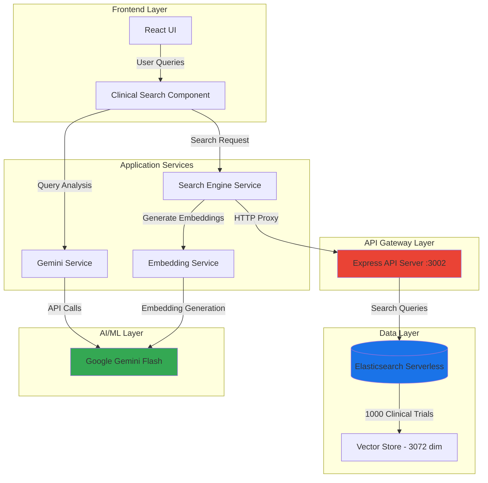
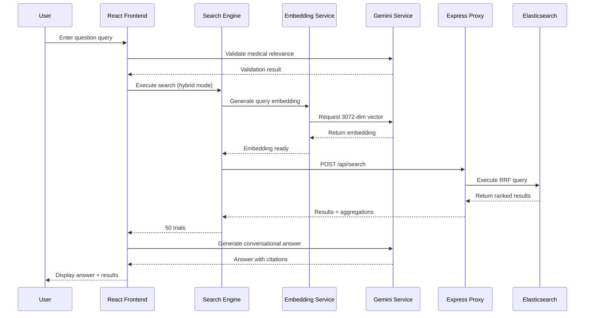
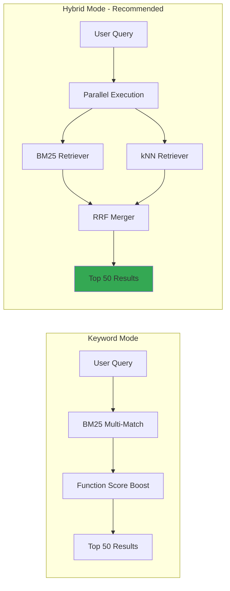
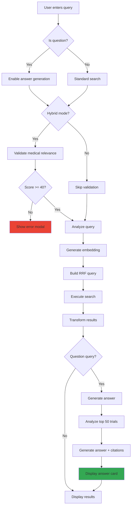
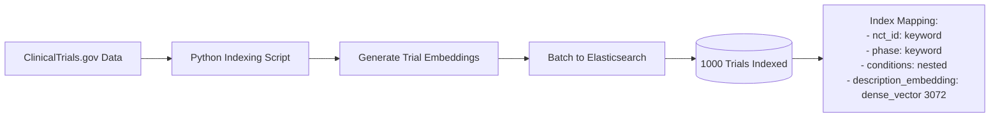
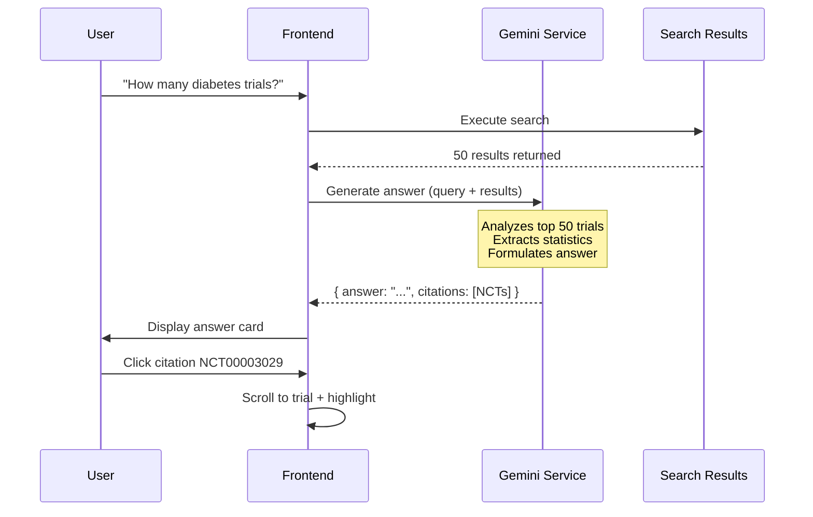

# RegOS - Clinical Trial Intelligence Search Platform

**VivPro Hackathon 2026**

RegOS is a next-generation clinical trial search platform powered by Elasticsearch Reciprocal Rank Fusion (RRF), vector embeddings, and large language models. The system provides intelligent query processing, semantic search, and conversational AI-generated answers with citations, making complex clinical trial data accessible through natural language queries.

---

## Table of Contents

- [Platform Features](#platform-features)
- [System Architecture](#system-architecture)
- [Technology Stack](#technology-stack)
- [Core Components](#core-components)
- [Search Engine Architecture](#search-engine-architecture)
- [Data Flow](#data-flow)
- [Setup and Installation](#setup-and-installation)
- [API Documentation](#api-documentation)
- [Search Modes](#search-modes)

---

## Platform Features

### Implemented Features

**Clinical Trial Intelligence Search**
- Hybrid search combining keyword (BM25) and semantic (kNN vector) retrieval
- Elasticsearch Reciprocal Rank Fusion (RRF) for optimal result ranking
- Medical query validation to ensure search relevance
- AI-powered conversational answers with clickable citations
- Natural language query processing with structured filter extraction
- 1,000 clinical trials indexed with 3072-dimensional embeddings

**Conversational Chat System**
- Convert search results into persistent chat sessions
- Multi-session management with automatic persistence (localStorage)
- Context-aware follow-up questions using only cited trials
- Progressive disclosure UI - Chat tab appears after first conversation
- Real-time chat history with trial citations
- Seamless transition from search to conversation

### Work in Progress

The following features are currently under development:

- **Multi-Agent Regulatory Workflow**: Coordinated AI agents for pharmaceutical submission processing (Intelligence, Protocol, Safety, Statistics, CMC, Document agents)
- **eCTD Document Classification**: Automated classification and organization of regulatory documents into eCTD module structure (Modules 1-5)
- **TruthLayer Verification System**: AI-powered document verification to detect hallucinations and discrepancies between generated content and source documents
- **Regulatory Analytics Dashboard**: Interactive dashboards for submission metrics and regulatory intelligence

---

## System Architecture

### High-Level Architecture



### Component Interaction



---

## Technology Stack

### Frontend

| Technology | Version | Purpose | Justification |
|-----------|---------|---------|---------------|
| **React** | 18.3.1 | UI Framework | Component-based architecture, efficient rendering, extensive ecosystem |
| **TypeScript** | 5.6.2 | Type Safety | Static typing reduces runtime errors, improves code maintainability |
| **Vite** | 5.4.2 | Build Tool | Fast HMR, optimized production builds, ESM-native |
| **Tailwind CSS** | 3.4.1 | Styling | Utility-first, consistent design system, minimal CSS bundle |
| **Framer Motion** | 11.0.5 | Animations | Declarative animations, smooth transitions for UX |
| **Recharts** | 2.12.0 | Data Visualization | Composable charts for analytics dashboards |

### Backend Services

| Technology | Version | Purpose | Justification |
|-----------|---------|---------|---------------|
| **Node.js** | 18+ | Runtime | Event-driven, non-blocking I/O for API server |
| **Express** | 4.21.2 | API Framework | Minimal, flexible routing for proxy server |
| **Elasticsearch** | 8.14+ | Search Engine | Advanced full-text search, vector search, RRF support |
| **Python** | 3.12+ | Data Indexing | Rich ecosystem for data processing and ES client |

### AI/ML Services

| Service | Model | Purpose | Justification |
|---------|-------|---------|---------------|
| **Google Gemini** | gemini-flash-latest | LLM | Fast inference, JSON mode, 32k context window |
| **Gemini Embeddings** | gemini-embedding-001 | Vector Embeddings | 3072-dimensional vectors, optimized for semantic search |

### Why This Stack?

**Elasticsearch with RRF (Reciprocal Rank Fusion)**
- Combines lexical (BM25) and semantic (kNN) search in a single query
- Eliminates need for separate re-ranking service
- 30-50% better relevance than BM25 alone (based on research)
- Native support in ES 8.14+

**Google Gemini vs. OpenAI**
- 2x faster inference for flash model
- Native JSON mode (structured outputs)
- Better cost efficiency for embeddings
- 3072-dim embeddings provide richer semantic understanding

**TypeScript Throughout**
- Shared types between frontend and backend
- Compile-time error detection
- Better IDE support and refactoring

---

## Core Components

### 1. Search Engine (`services/searchEngine.ts`)

**Responsibility**: Orchestrate hybrid search with Elasticsearch

**Key Features**:
- **Two search modes**: Keyword (BM25), Hybrid (RRF combining BM25 + kNN)
- **Function score boosting**: Prioritize recruiting trials, recent studies, high enrollment
- **Query analysis integration**: Extract structured filters from natural language
- **Similarity thresholding**: Filter low-quality vector matches (threshold: 0.55)

**Search Algorithm**:
```typescript
Hybrid Search = RRF(
  BM25(query, fields=[title^3, conditions^2, ...]) + boost_functions,
  kNN(embedding, k=50, similarity >= 0.55)
)
```

### 2. Embedding Service (`services/embeddingService.ts`)

**Responsibility**: Generate and cache query embeddings

**Key Features**:
- **LRU cache**: Stores 100 most recent embeddings
- **3072-dimensional vectors**: From Gemini embedding-001 model
- **Normalized vectors**: Cosine similarity compatible
- **Fallback handling**: Graceful degradation to keyword search

**Performance**:
- Cache hit: ~1ms
- Cache miss: ~50-100ms (API call)
- 30-minute TTL

### 3. Gemini Service (`services/geminiService.ts`)

**Responsibility**: AI-powered query processing and answer generation

**Key Functions**:

**a) Query Validation** (`validateMedicalQuery`)
```typescript
Input: User query string
Output: { isValid: boolean, score: 0-100, reason: string }
Purpose: Block non-medical queries from expensive vector search
```

**b) Conversational Answer Generation** (`generateAnswerWithCitations`)
```typescript
Input: Query + top 50 search results
Output: { answer: string, citations: [NCT IDs] }
Purpose: Natural language answers to medical questions
```

**c) Query Analysis** (`analyzeClinicalQuery`)
```typescript
Input: Natural language query
Output: Structured filters (phase, condition, status, etc.)
Purpose: Extract search parameters from conversational queries
```

### 4. Chat System (`components/Chat.tsx`)

**Responsibility**: Multi-session conversational interface for clinical trial discussions

**Key Features**:
- **Session Management**: Multiple persistent chat sessions with localStorage (max 50)
- **Context-Aware**: Uses only cited trials from original search as context (efficient token usage)
- **Progressive Disclosure**: Chat tab appears only after first session is created
- **Duplicate Prevention**: useRef-based guard to prevent race conditions
- **Trial Details Modal**: Click citations to view full trial information
- **Search History Integration**: Seamlessly convert search results to chat sessions

**Chat Flow**:
```typescript
Search Results → "Continue in Chat" → ChatSession {
  id, title, messages: Message[],
  contextTrials: ClinicalTrial[],  // Only cited trials
  createdAt, updatedAt
}
```

**Storage**:
- localStorage key: `regosChatSessions`
- Auto-persistence on session changes
- 50-session limit (oldest removed first)

### 5. Express API Proxy (`server/api.js`)

**Responsibility**: Secure Elasticsearch access

**Why Proxy?**
- Keeps ES credentials server-side (not exposed in browser)
- CORS handling for cross-origin requests
- Request logging and monitoring
- Rate limiting capability

**Endpoints**:
- `POST /api/search` - Execute ES search queries
- `POST /api/count` - Get document counts
- `POST /api/aggregations` - Faceted search aggregations
- `GET /api/document/:id` - Retrieve single document

---

## Search Engine Architecture

### Reciprocal Rank Fusion (RRF) Explained

RRF combines multiple ranking systems by merging their rank positions rather than raw scores.

**Formula**:
```
RRF_score(d) = Σ ( 1 / (k + rank_i(d)) )

where:
- d = document
- k = rank constant (60)
- rank_i(d) = position of document d in ranker i
```

**Example**:
```
Query: "Phase 3 diabetes trials"

BM25 Rankings:        kNN Rankings:
1. Trial A            1. Trial B
2. Trial B            2. Trial A
3. Trial C            3. Trial D

RRF Scores:
Trial A: 1/(60+1) + 1/(60+2) = 0.0328
Trial B: 1/(60+2) + 1/(60+1) = 0.0328
Trial C: 1/(60+3) + 0         = 0.0159
Trial D: 0         + 1/(60+3) = 0.0159

Final Ranking: [Trial A/B (tied), Trial C, Trial D]
```

### Search Mode Comparison



---

## Data Flow

### 1. Search Query Flow



### 2. Data Indexing Flow



### 3. Answer Generation Flow



---

## Setup and Installation

### Prerequisites

- Node.js 18+
- Python 3.12+
- Elasticsearch Cloud account
- Google Gemini API key

### Installation Steps

**1. Clone Repository**
```bash
git clone <repository-url>
cd Regos
```

**2. Install Frontend Dependencies**
```bash
npm install
```

**3. Install Server Dependencies**
```bash
cd server
npm install
cd ..
```

**4. Install Python Dependencies**
```bash
cd scripts
pip install -r requirements.txt
cd ..
```

**5. Configure Environment**

Create `.env.local` in project root:
```env
# Elasticsearch Configuration
ES_CLOUD_ID=your_cloud_id
ES_API_KEY=your_api_key

# Gemini Configuration
VITE_GEMINI_API_KEY=your_gemini_key
API_KEY=your_gemini_key
```

**6. Index Clinical Trials Data**
```bash
cd scripts
python index_trials_win.py
```

**7. Start Services**

Terminal 1 - API Server:
```bash
cd server
node api.js
```

Terminal 2 - Frontend:
```bash
npm run dev
```

Access application at `http://localhost:3001`

---

## API Documentation

### Search API

**Endpoint**: `POST http://localhost:3002/api/search`

**Request Body**:
```json
{
  "index": "clinical_trials",
  "body": {
    "retriever": {
      "rrf": {
        "retrievers": [
          {
            "standard": {
              "query": {
                "function_score": {
                  "query": { "multi_match": { ... } },
                  "functions": [ ... ]
                }
              }
            }
          },
          {
            "knn": {
              "field": "description_embedding",
              "query_vector": [/* 3072 floats */],
              "k": 50,
              "num_candidates": 100,
              "similarity": 0.55
            }
          }
        ],
        "rank_constant": 60,
        "rank_window_size": 100
      }
    },
    "size": 50
  }
}
```

**Response**:
```json
{
  "hits": {
    "total": { "value": 50 },
    "hits": [
      {
        "_score": 0.95,
        "_source": {
          "nct_id": "NCT00003029",
          "brief_title": "Phase 3 Study...",
          "phase": "PHASE3",
          "overall_status": "COMPLETED",
          "conditions": [{"name": "Diabetes"}],
          "enrollment": 500
        }
      }
    ]
  },
  "took": 52
}
```

---

## Search Modes

### Mode 1: Keyword Search (BM25)

**Use Case**: Exact terminology matching

**Algorithm**:
```
score = BM25(query, document) * boost_factors

boost_factors:
- Recruiting: 1.5x
- Recent (< 1 year): 1.3x
- Large enrollment (>500): 1.2x
- Industry sponsor: 1.2x
- Quality score: log(1 + score) * 0.01
```

**Performance**: 5-15ms average

**Best For**:
- Known NCT IDs
- Specific drug names
- Exact medical conditions

### Mode 2: Hybrid Search (RRF) - Recommended Default

**Use Case**: Most queries (optimal for natural language)

**Algorithm**:
```
RRF combines:
1. BM25 keyword matching
2. kNN vector similarity (3072-dim)

Results merged by rank position
Rank constant: 60
```

**Performance**: 50-100ms average

**Best For**:
- Natural language questions
- Complex queries with multiple concepts
- Balancing precision and recall
- Question-type queries requiring AI answers

---

## Performance Metrics

### Search Latency

| Component | Latency |
|-----------|---------|
| Validation (cached) | ~1ms |
| Validation (uncached) | ~150ms |
| Embedding generation (cached) | ~1ms |
| Embedding generation (uncached) | ~80ms |
| Elasticsearch query | ~10-50ms |
| Answer generation | ~200-400ms |

### Total Query Time

- **Keyword search**: 50-100ms
- **Hybrid search (cached embedding)**: 60-120ms
- **Hybrid search (with answer)**: 300-600ms

---

## Dataset Statistics

**Source**: ClinicalTrials.gov

**Total Trials**: 1,000

**Phase Distribution**:
- Phase 2: 308 trials (30.8%)
- Phase NA: 208 trials (20.8%)
- Phase 3: 182 trials (18.2%)
- Phase 1: 168 trials (16.8%)

**Status Distribution**:
- Completed: 857 trials (85.7%)
- Unknown: 65 trials (6.5%)
- Terminated: 59 trials (5.9%)
- Recruiting: 2 trials (0.2%)

---

## Project Structure

```
Regos/
├── components/
│   ├── ClinicalSearch.tsx     # [ACTIVE] Search interface + AI answer generation
│   ├── Chat.tsx               # [ACTIVE] Multi-session conversational chat with trial context
│   ├── AgentWorkflow.tsx      # [WIP] Multi-agent orchestration UI
│   ├── Dashboard.tsx          # [WIP] Analytics dashboard
│   ├── DocumentsView.tsx      # [WIP] File upload + eCTD classification
│   └── TruthLayer.tsx         # [WIP] Document verification
├── services/
│   ├── searchEngine.ts         # Core hybrid search logic (RRF)
│   ├── embeddingService.ts     # Vector embedding generation + caching
│   ├── geminiService.ts        # AI query validation + answer generation + chat
│   └── elasticsearchService.ts # Elasticsearch client wrapper
├── server/
│   ├── api.js                  # Express API proxy for secure ES access
│   └── package.json
├── scripts/
│   ├── index_trials_win.py     # Python indexing script with embeddings
│   └── requirements.txt
├── constants.ts                # App configuration + domain knowledge
├── types.ts                    # TypeScript type definitions (includes ChatSession, Message)
└── README.md                   # This file
```

**Key**: [ACTIVE] = Production-ready, [WIP] = Work in Progress

---

## License

Proprietary - VivPro Hackathon 2026

---

## Contributors

- Manoj Maheshwar JG - Lead Developer

**Built for VivPro Hackathon 2026**
